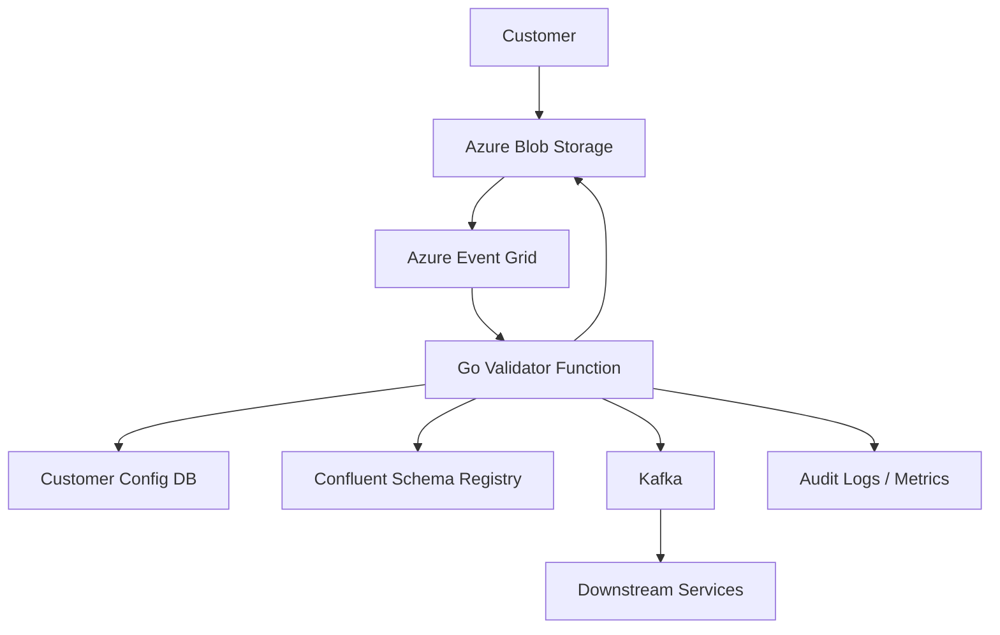

# File-Based Ingestion System

A high-performance, modular ingestion pipeline for healthcare order and claim files. Built in Go, this system enables
secure file uploads, schema validation, and reliable streaming to Kafka for downstream analytics and processing.

## Features

- Upload via Azure Blob Storage or SFTP
- Per-customer Avro schema validation
- Kafka publishing with rich metadata headers
- Configurable via PostgreSQL
- Structured logging and tracing (Datadog, OpenTelemetry)
- Audit trail for every file processed
- Local development with Docker Compose

## Architecture



- **Azure Blob Storage**: Each customer uploads files to their own container.
- **Event Grid**: Triggers the Go validator function on new file uploads.
- **Go Validator Function**: Downloads, validates, and streams records to Kafka.
- **Confluent Schema Registry**: Stores and serves Avro schemas.
- **Kafka**: Decouples ingestion from downstream consumers.
- **PostgreSQL**: Stores customer configs and audit logs.

## Quickstart

### Prerequisites

- Docker & Docker Compose
- Azure CLI (for local blob upload)
- Go 1.24+ (for local builds)

### Local Development

1. Clone the repo
2. Start all services:

    ```sh
    make test-local
    ```

   This builds the validator, starts all containers, uploads a sample file, and prints logs.

3. Check Kafka output:

   The script will consume messages from the `orders.raw` topic and show validator logs.

## Project Structure

- `cmd/function/` — Main entrypoint (Azure Function or local)
- `internal/services/` — File validation and processing logic
- `internal/adapters/` — Integrations: Blob, Kafka, Schema Registry, Postgres
- `internal/domain/` — Domain models and errors
- `test-files/` — Sample files and test scripts
- `docker-compose.yml` — Local dev stack

## Configuration

Set environment variables (see `docker-compose.yml` for examples):

- `AzureWebJobsStorage`
- `DB_CONNECTION_STRING`
- `KAFKA_BOOTSTRAP_SERVERS`
- `ENVIRONMENT` (set to `local` for local dev)

## Example: Processing a File

1. Customer uploads a CSV to their Azure Blob container.
2. Event Grid triggers the Go validator.
3. Validator:
    - Loads customer config and Avro schema
    - Validates and encodes each record
    - Publishes to Kafka with headers (`x-customer-id`, `x-schema-version`, etc.)
    - Logs audit info to Postgres
4. Downstream consumers read from Kafka topics.

## Extending

- Add new file types or schemas by updating the config DB and schema registry.
- Add new downstream consumers by subscribing to Kafka topics.


