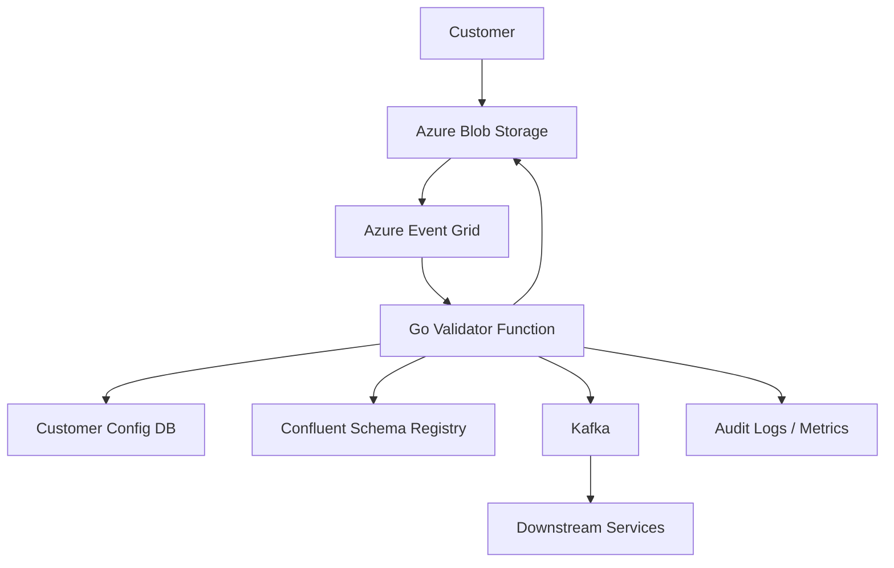

# File-Based Ingestion System for Orders and Claims

## Overview

This system enables healthcare customers to upload Excel/CSV files containing orders or claims. Uploaded files are
validated against customer-specific Avro schemas and published to Kafka topics for downstream processing.

Uploads occur daily or weekly. The system is designed to be fast, modular, and observable, using **Go** for performance,
**Avro** for schema validation, **Kafka** for decoupling, and **Datadog** for monitoring.

---

## Requirements

### Must Have

- File upload via Azure Blob Storage or SFTP
- Schema validation using Apache Avro
- Kafka publishing of validated records
- Logging, tracing, and metrics
- File-level audit logs

### Should Have

- Per-customer schema and config
- Quarantine/invalid file handling
- Optional transformation to unified schema

---

## Architecture

# File-Based Ingestion System for Orders and Claims

## Overview

This system enables healthcare customers to upload Excel/CSV files containing orders or claims. Uploaded files are
validated against customer-specific Avro schemas and published to Kafka topics for downstream processing.

Uploads occur daily or weekly. The system is designed to be fast, modular, and observable, using **Go** for performance,
**Avro** for schema validation, **Kafka** for decoupling, and **Datadog** for monitoring.

---

## Requirements

### Must Have

- File upload via Azure Blob Storage or SFTP
- Schema validation using Apache Avro
- Kafka publishing of validated records
- Logging, tracing, and metrics
- File-level audit logs

### Should Have

- Per-customer schema and config
- Quarantine/invalid file handling
- Optional transformation to unified schema

## Architecture

---

## Components

### 1. Azure Blob Storage

- One container per customer (e.g., `cust123-orders`)
- Access via write-only SAS URLs or Azure SFTP
- Event Grid triggers on blob creation

### 2. Customer Config DB

| customer_id | schema_subject    | kafka_topic | file_pattern  | validation_profile |
|-------------|-------------------|-------------|---------------|--------------------|
| cust123     | cust123-orders-v1 | orders.raw  | cust123-*.csv | standard_orders    |

### 3. Schema Registry

- Hosted on Confluent Cloud
- Subjects follow the format: `<customer>-<filetype>-v<version>`
- Accessed over HTTPS, optionally cached locally

### 4. Go Validator Function

- Deployed as Azure Function (Linux Premium Plan)
- Responsibilities:
    - Triggered via Event Grid
    - Loads file from Blob
    - Fetches config and schema
    - Parses and validates file
    - Publishes to Kafka
    - Logs events, metrics, and errors

#### Dependencies

- `goavro` for schema validation
- `confluent-kafka-go` for Kafka
- `zap` or `logrus` for structured logging
- Azure Blob SDK for Go
- OpenTelemetry or Datadog APM SDK (optional)

### 5. Kafka Topics (Confluent Cloud)

- Raw topics: `orders.raw`, `claims.raw`
- Optional cleaned topics: `orders.cleaned`
- Headers include:
    - `x-customer-id`
    - `x-schema-version`
    - `x-ingestion-ts`

### 6. Optional Transformer

- Optional microservice to normalize raw records into unified internal schemas
- Subscribes to raw topics, emits to cleaned topics

### 7. Logging & Monitoring (Datadog)

- Environment variables set via Terraform:
    - `DD_API_KEY`
    - `DD_ENV`
    - `DD_SERVICE=file-validator`
    - `DD_VERSION=1.0.0`
- JSON logs to stdout (`zap`)
- Tracing via Datadog APM

---

## Implementation Steps

1. **Provision Azure Blob Storage and Event Grid**
2. **Deploy Customer Config DB (PostgreSQL, Cosmos DB, or Table Storage)**
3. **Upload Avro schemas to Confluent Schema Registry**
4. **Develop Go Validator Function with Event Grid trigger**
5. **Integrate Kafka publishing (Confluent Cloud or Event Hubs Kafka API)**
6. **Create audit logging mechanism (Blob or DB)**
7. **(Optional) Add transformer microservice**
8. **Test with sample files**

## Future Enhancements

- Add UI for file submission and status
- Workflow to support schema evolution

