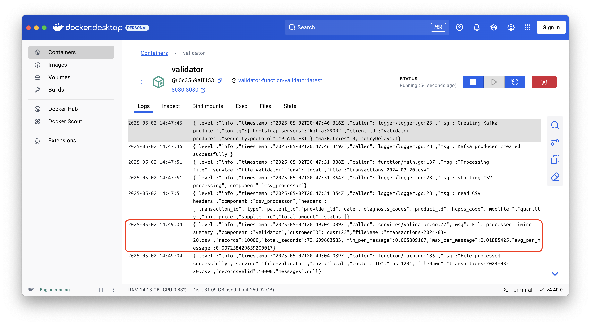
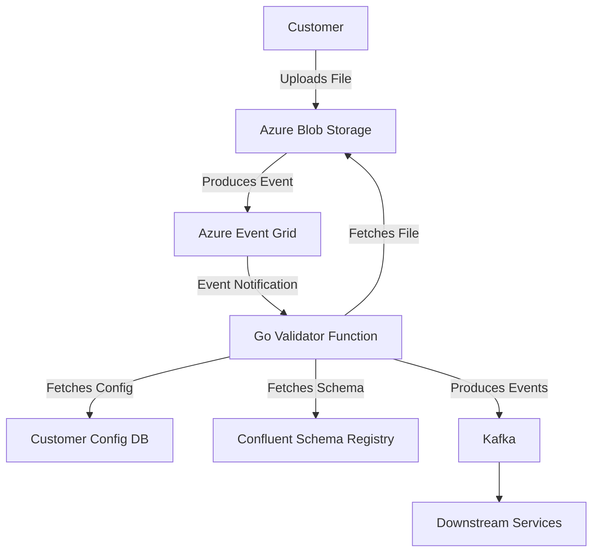

# File-Based Ingestion System: Go Validator Function

## Overview

This document outlines the architecture, benefits, and current limitations of our new file-based ingestion system, built
using Go. This system is designed to efficiently and reliably process healthcare orders and claim files, validate them
against customer-specific Avro schemas, and stream the validated records to Kafka for downstream analytics and
processing.

## Value Proposition: Why This System?

This system offers significant advantages over previous approaches, such as .NET functions with MediatR and ShareFile
integration.

* **Performance**: Go's performance allows for faster processing of large files. In a recent test, the system processed
  and published 10,000 order records to Kafka in approximately 72 seconds.
  
* **Cost Efficiency**: Go applications generally have a smaller memory footprint and lower CPU utilization compared to
  .NET, potentially reducing infrastructure costs.
* **Modularity and Maintainability**: The Go-based architecture promotes modularity, making the system easier to
  maintain, extend, and test.
* **No ShareFile Integration**: By using Azure Blob Storage, we can avoid using ShareFile in the future.

### Direct Uploads to Azure Blob Storage (Future State)

To further enhance our system and eliminate the dependency on ShareFile, we can enable customers to upload files
directly to Azure Blob Storage. This approach offers several advantages:

* **Simplified Architecture**: Removes the need for ShareFile and associated webhooks, streamlining the data ingestion
  process.
* **Enhanced Security**: Provides direct control over access permissions and expiry times using SAS tokens.
* **Cost Efficiency**: Reduces costs by eliminating a third-party service.
* **Improved Integration**: Enables tighter integration with Azure services like Event Grid and Azure Functions.

**How it Works:**

1. **SAS Token Generation**: Our backend service generates a SAS (Shared Access Signature) token with write-only access
   to the customer's designated blob container. The SAS token has a limited lifespan to ensure security.
2. **Secure Upload**: The customer uses the SAS token to upload files directly to Azure Blob Storage via tools like
   `azcopy`, `curl`, Azure Storage Explorer, or a custom web application.
3. **Event Trigger**: Azure Event Grid detects the new file and triggers the Go validator function.
4. **Automated Processing**: The Go validator function processes the uploaded file, validating it against the
   customer-specific Avro schema and streaming the validated records to Kafka.

This approach provides a secure, efficient, and cost-effective alternative to ShareFile for file uploads.

## Architecture

### Current Limitations

* **Schema Changes**: The system currently does not support schema evolution or automatic schema updates. Any changes to
  the schema require manual intervention.
  This is an area for future improvement to allow for dynamic schema updates.